# Obsidian MCP Server

A [Model Context Protocol](https://modelcontextprotocol.io) server that lets any MCP client read and edit Obsidian vaults. Built with **FastMCP 3.4.2**, **obsidiantools**, and **py-obsidianmd**.

---

## Stack

| Package | Role |
|---|---|
| `fastmcp` | MCP server + client SDK |
| `obsidiantools` | Vault graph analysis, note reading |
| `py-obsidianmd` | Note metadata / frontmatter patching |
| `uv` | Virtual environment and dependency management |

---

## Project structure

```
mcp/
├── mcp_server.py   — FastMCP server (tools, resources, prompts)
├── mcp_client.py   — Async client (list/call tools, prompts, resources)
├── main.py         — HTTP entry point (default: http://127.0.0.1:8085/mcp)
├── pyproject.toml  — uv project config
└── .venv/          — isolated Python environment
```

---

## Setup

```bash
# 1. Enter the folder
cd mcp

# 2. Create venv and install all dependencies
uv venv
uv add fastmcp obsidiantools py-obsidianmd

# 3. Generate your inspector token and save it (do this once)
echo "MCP_TOKEN=$(openssl rand -hex 32)" >> .env

# 4. Verify the environment
uv run python -c "import fastmcp, obsidiantools; print('OK')"
```

> **Note on py-obsidianmd**: the `pyomd` module imports `pkg_resources`, which was removed in Python 3.12+. The server wraps the import in a `try/except` and falls back gracefully; all other functionality is unaffected.

---

## Authentication

### How it works

The MCP Inspector proxy protects itself with a bearer token so that other browser tabs or local processes cannot hijack your running server. The token flow is:

```
openssl rand -hex 32  →  MCP_PROXY_AUTH_TOKEN env var  →  proxy reads it on start
                                                        →  prints it to terminal
                                                        →  appends it to the browser URL
                                                        →  browser sends it as a header on every request
```

- If `MCP_PROXY_AUTH_TOKEN` is **not set**, the proxy auto-generates a random token each run — the URL changes every time.
- If `MCP_PROXY_AUTH_TOKEN` **is set**, the proxy uses that value — the URL stays stable across restarts.
- `DANGEROUSLY_OMIT_AUTH=true` disables auth entirely. **Do not use this** — it exposes your local machine to any website you visit while the proxy is running.

### Generate your token (one-time)

```bash
# Inside mcp/
echo "MCP_TOKEN=$(openssl rand -hex 32)" >> .env
```

This appends a line like `MCP_TOKEN=a3f9...` to `.env`. The `.env` file is gitignored so your token is never committed.

To view your token at any time:

```bash
grep MCP_TOKEN .env
```

### Launch the inspector with your token

```bash
# Load token from .env and launch
export $(grep MCP_TOKEN .env) && \
  MCP_PROXY_AUTH_TOKEN=$MCP_TOKEN PATH="$(pwd)/.venv/bin:$PATH" \
  fastmcp dev inspector mcp_server.py --ui-port 5078 --server-port 3000
```

The terminal prints your stable browser URL:

```
🔑 Session token: a3f9...          ← same as MCP_TOKEN
🚀 MCP Inspector is up and running at:
   http://localhost:5078/?MCP_PROXY_PORT=3000&MCP_PROXY_AUTH_TOKEN=a3f9...
```

Open that URL — click **Connect** — done.

### One-liner alias (optional, add to `~/.zshrc`)

```bash
alias mcp-inspect='cd /path/to/claude_lab/mcp && export $(grep MCP_TOKEN .env) && MCP_PROXY_AUTH_TOKEN=$MCP_TOKEN PATH="$(pwd)/.venv/bin:$PATH" fastmcp dev inspector mcp_server.py --ui-port 5078 --server-port 3000'
```

---

## Implementation

### Server — `mcp_server.py`

The server auto-discovers Obsidian vaults from
`~/Library/Application Support/obsidian/obsidian.json` (macOS).

#### Tools

| Tool | Arguments | Description |
|---|---|---|
| `list_vaults` | — | Returns all vaults registered in Obsidian desktop |
| `edit_vault` | `vault_path`, `action`, `target`, `new_name?` | Manages vault structure: `create_folder`, `create_note`, `rename_note`, `delete_note` |
| `read_document` | `vault_path`, `note_name` | Reads markdown source of a note by stem (no `.md`) via `obsidiantools` |
| `edit_document` | `vault_path`, `note_name`, `content` | Overwrites or creates a note with the given content |

#### Resources

| URI | Content |
|---|---|
| `obsidian://docs/obsidian` | Obsidian concepts: vaults, notes, wikilinks, frontmatter, canvas |
| `obsidian://docs/obsidiantools` | Python API reference for the `obsidiantools` package |
| `obsidian://docs/fastmcp` | FastMCP SDK quick-reference: server, client, decorators |
| `obsidian://docs/py-obsidianmd` | `pyomd` API for frontmatter reading/writing |

#### Prompts

| Prompt | Arguments | Behaviour |
|---|---|---|
| `patch_document` | `vault_path`, `note_name`, `search_text`, `replacement_text` | Returns a step-by-step instruction to patch a specific section without rewriting the whole file |
| `vault_summary` | `vault_path` | Returns a prompt that forces the model to produce a ≤ 250-character plain-text vault summary |

### Client — `mcp_client.py`

Five async helper functions that connect to the server via stdio:

```python
await list_tools()                          # → list[{name, description}]
await call_tool("list_vaults", {})          # → str (JSON or plain text)
await list_prompts()                        # → list[{name, description}]
await get_prompt("vault_summary", {...})    # → str (rendered prompt text)
await list_resources()                      # → list[{uri, name, description}]
await read_resource("obsidian://docs/obsidian")  # → str (markdown)
```

### Entry point — `main.py`

HTTP server with optional transport override:

```bash
uv run main.py                        # HTTP on http://127.0.0.1:8000/mcp
uv run main.py --transport stdio      # stdio (for Claude Desktop / MCP host)
uv run main.py --transport sse        # SSE on port 8000
uv run main.py --port 9000            # custom port
```

---

## Running

### Option 1 — HTTP server (browser + any HTTP MCP client)

```bash
uv run main.py
```

Server starts at **`http://127.0.0.1:8085/mcp`**

The endpoint speaks [MCP streamable-HTTP](https://modelcontextprotocol.io/docs/concepts/transports) and requires an `Accept: text/event-stream` header. Use the MCP Inspector (below) to explore it from the browser.

### Option 2 — MCP Inspector (browser UI)

```bash
PATH="$(pwd)/.venv/bin:$PATH" fastmcp dev inspector mcp_server.py --ui-port 5078 --server-port 3000
```

Opens the official MCP Inspector at **`http://localhost:5078`** with a proxy server on port 3000.

> **Why the `PATH` prefix?** The inspector proxy spawns `fastmcp run mcp_server.py` as a subprocess but Node.js does not inherit the activated venv. Without prepending `.venv/bin`, the proxy can't find `fastmcp` and returns a 500 error on Connect. Prepending it ensures the proxy resolves `fastmcp` from the local venv.

The Inspector is a full browser UI — it is NOT the `/mcp` HTTP endpoint (which is a protocol endpoint that returns 406 in a regular browser because it requires `Accept: text/event-stream`). Always use the Inspector URL to explore the server from a browser.

From the Inspector you can:
- **Tools tab** — see all 4 tools, fill in arguments, and call them live (e.g. `list_vaults` returns your registered Obsidian vaults)
- **Resources tab** — read any of the 4 `obsidian://docs/*` documentation resources
- **Prompts tab** — render `patch_document` or `vault_summary` with real arguments

To stop: `pkill -f "fastmcp dev"`

**Connect tip:** in the inspector form, set **Transport Type → STDIO**, fill **Command** with the full path to your venv's `fastmcp` binary (e.g. `/path/to/mcp/.venv/bin/fastmcp`) and **Arguments** with `run /path/to/mcp/mcp_server.py --no-banner`, then click Connect.

#### Inspector screenshots

| | |
|---|---|
| 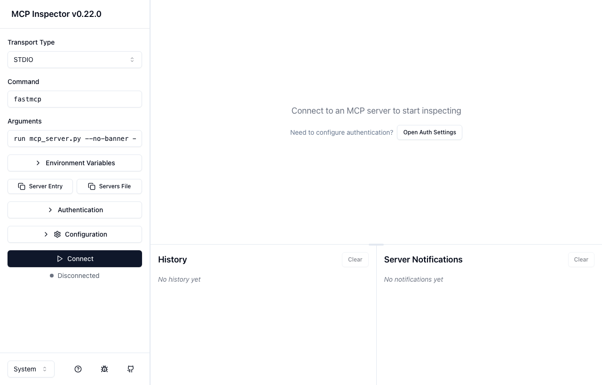 | 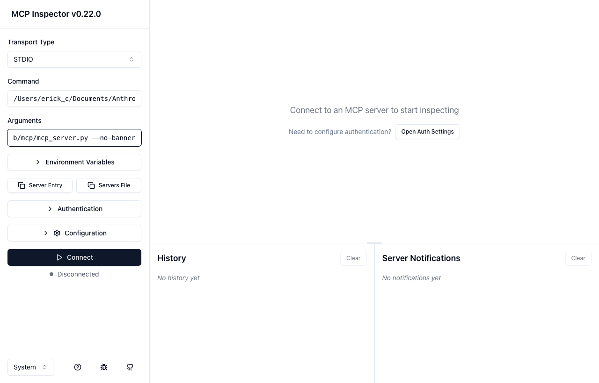 |
| *Landing — transport config form* | *STDIO command configured* |
| 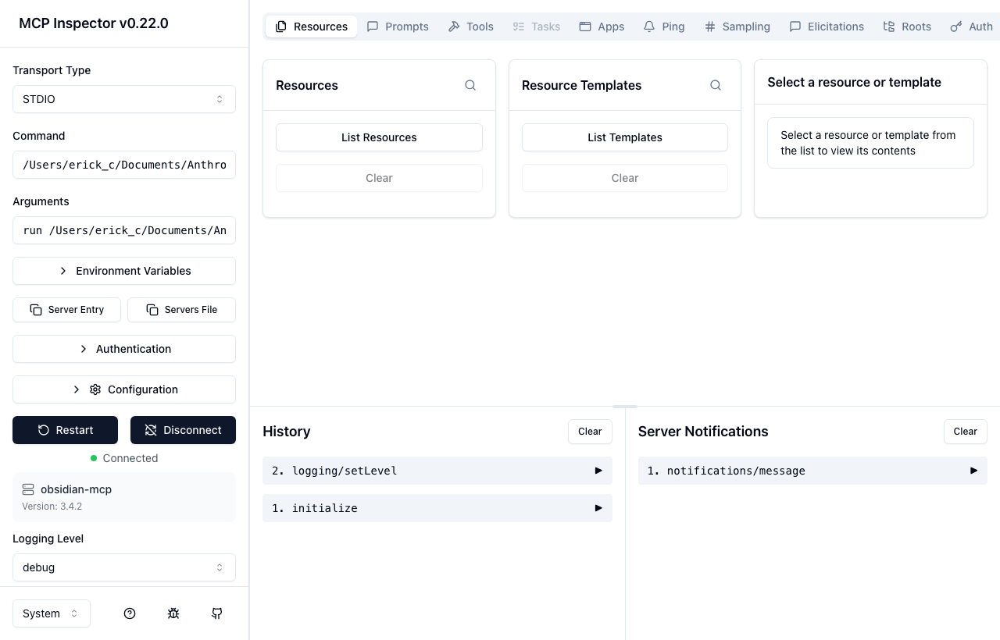 | 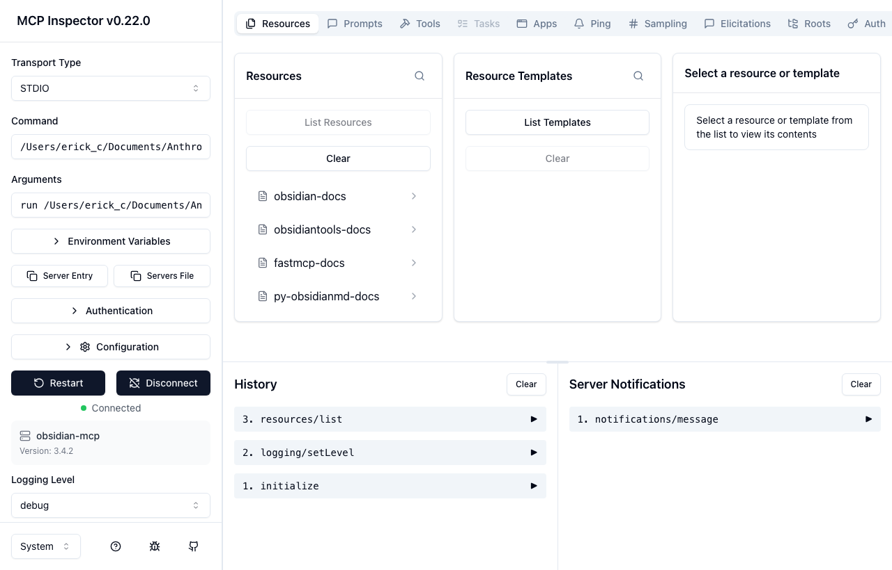 |
| *Connected — server info & nav* | *Resources tab — 4 obsidian://docs/* URIs* |
| 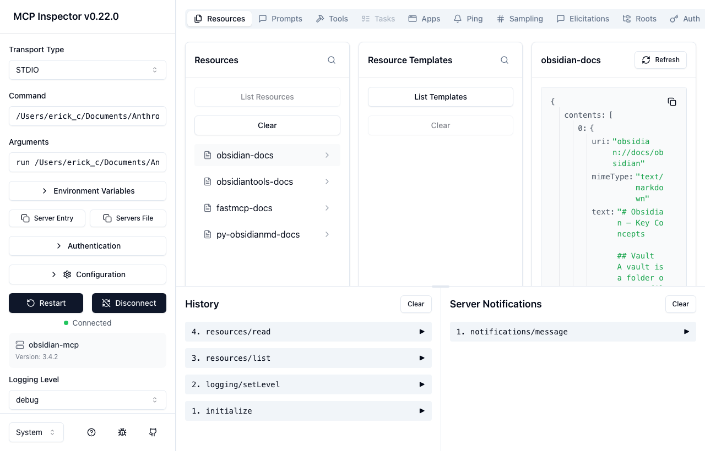 | 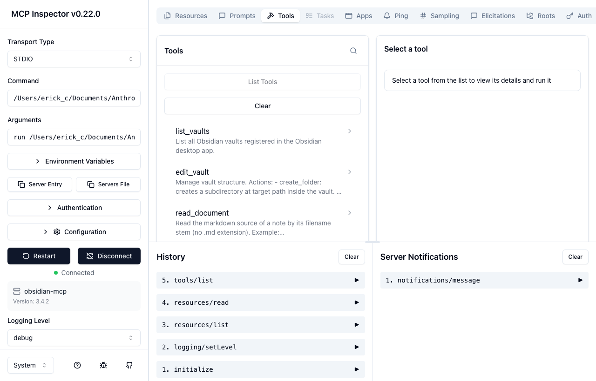 |
| *obsidian://docs/obsidian content* | *Tools tab — all 4 tools* |
| 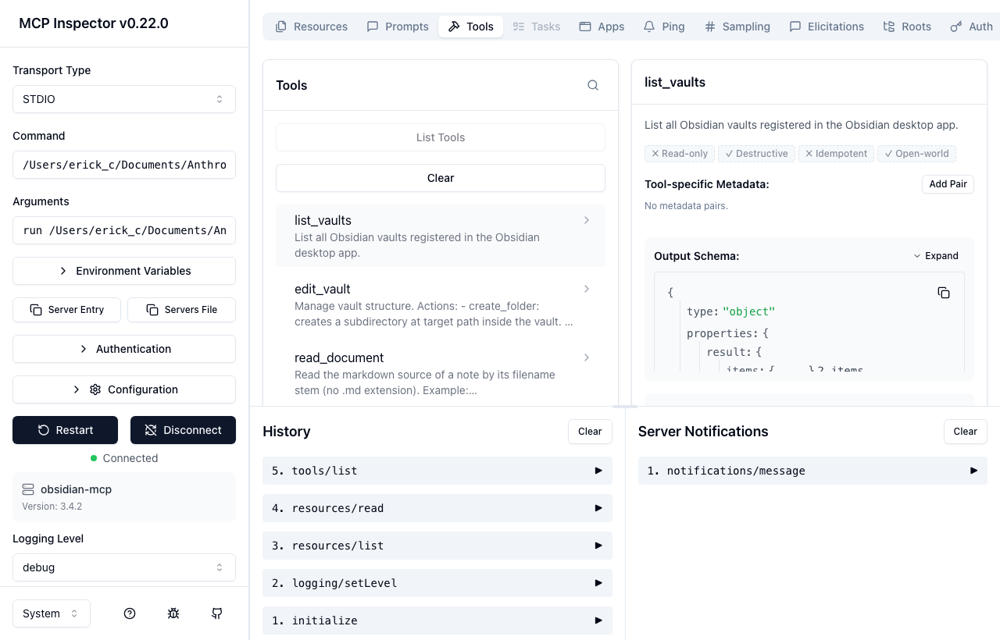 | 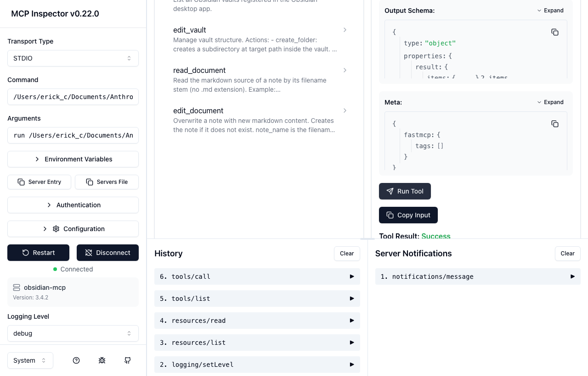 |
| *list_vaults tool selected* | *list_vaults result — vault JSON* |
| 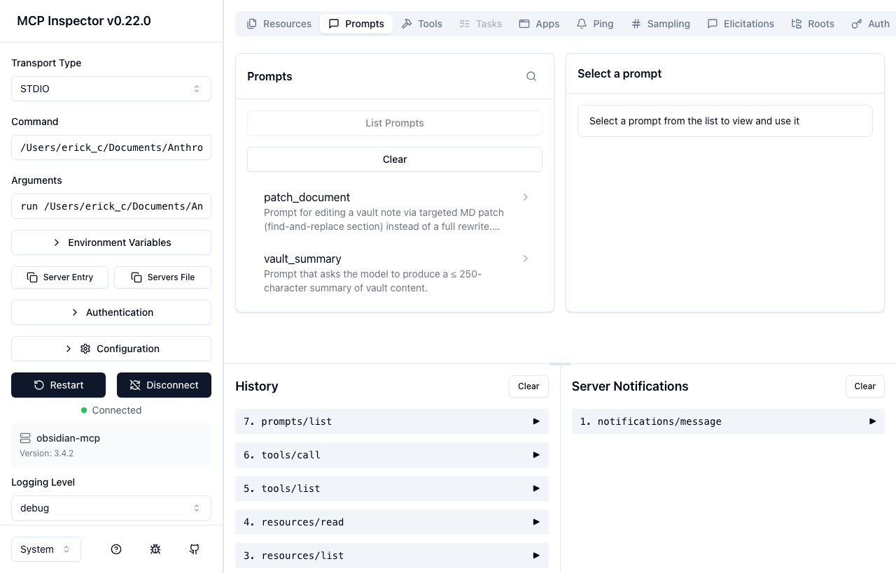 | 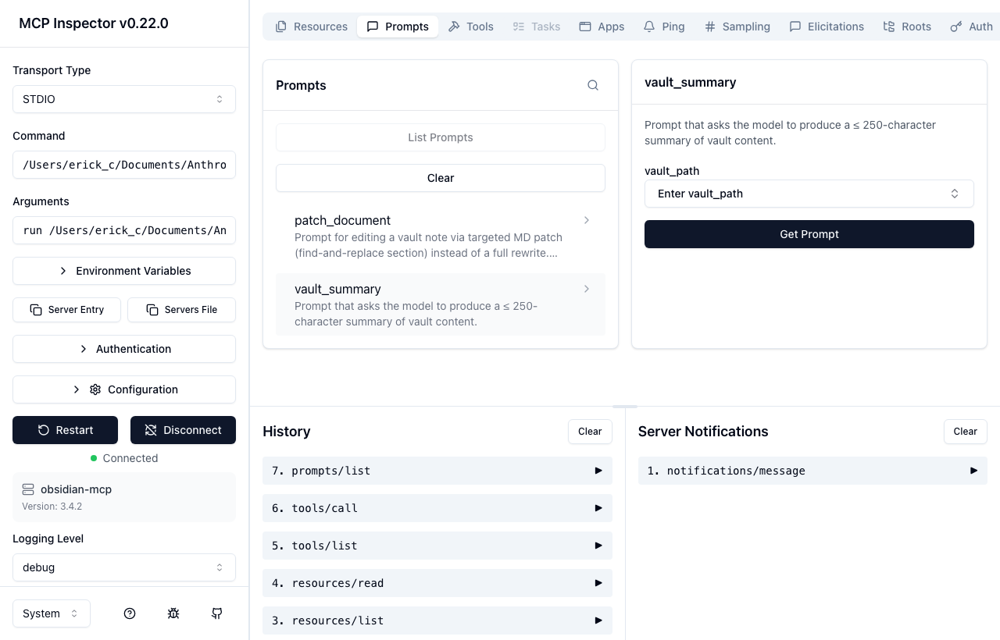 |
| *Prompts tab — patch_document & vault_summary* | *vault_summary argument form* |
| 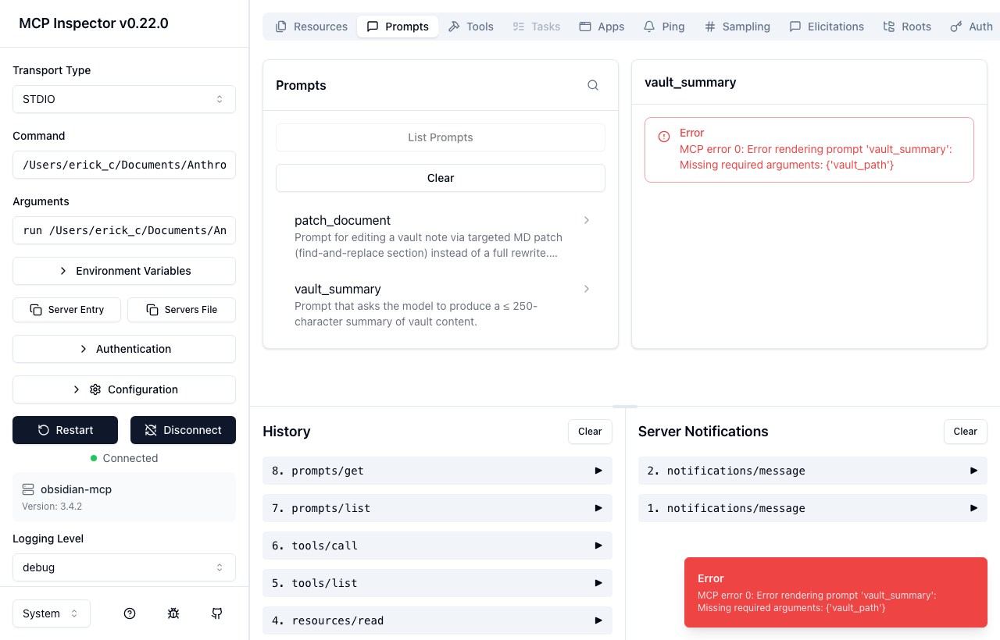 | |
| *vault_summary rendered prompt* | |

### Option 3 — Python client

```bash
uv run python mcp_client.py
```

Runs `_demo()`: lists all tools / prompts / resources, calls `list_vaults`, renders `vault_summary`, and reads the `obsidian://docs/obsidian` resource.

### Option 4 — HTTP entry point

```bash
uv run main.py
```

---

## Testing

### Smoke test — list all components

```bash
uv run python - <<'EOF'
import asyncio
from fastmcp import Client

async def main():
    async with Client("mcp_server.py") as c:
        tools     = await c.list_tools()
        prompts   = await c.list_prompts()
        resources = await c.list_resources()
        print(f"Tools:     {[t.name for t in tools]}")
        print(f"Prompts:   {[p.name for p in prompts]}")
        print(f"Resources: {[str(r.uri) for r in resources]}")

asyncio.run(main())
EOF
```

Expected output:
```
Tools:     ['list_vaults', 'edit_vault', 'read_document', 'edit_document']
Prompts:   ['patch_document', 'vault_summary']
Resources: ['obsidian://docs/obsidian', 'obsidian://docs/obsidiantools', 'obsidian://docs/fastmcp', 'obsidian://docs/py-obsidianmd']
```

### Test `list_vaults` tool

```bash
uv run python - <<'EOF'
import asyncio, json
from fastmcp import Client

async def main():
    async with Client("mcp_server.py") as c:
        result = await c.call_tool("list_vaults", {})
        vaults = json.loads(result.content[0].text)
        for v in vaults:
            print(v["path"])

asyncio.run(main())
EOF
```

### Test `read_document` tool

```bash
uv run python - <<'EOF'
import asyncio
from fastmcp import Client

async def main():
    async with Client("mcp_server.py") as c:
        result = await c.call_tool("read_document", {
            "vault_path": "/Users/erick_c/Documents/Sunny",
            "note_name": "your-note-name"   # stem only, no .md
        })
        print(result.content[0].text[:500])

asyncio.run(main())
EOF
```

### Test `vault_summary` prompt

```bash
uv run python - <<'EOF'
import asyncio
from fastmcp import Client

async def main():
    async with Client("mcp_server.py") as c:
        result = await c.get_prompt("vault_summary", {
            "vault_path": "/Users/erick_c/Documents/Sunny"
        })
        print(result.messages[0].content.text)

asyncio.run(main())
EOF
```

### Full client demo

```bash
uv run python mcp_client.py
```

Terminal output (actual run):
```
=== Tools ===
  list_vaults: List all Obsidian vaults registered in the Obsidian desktop app.
  edit_vault: Manage vault structure. ...
  read_document: Read the markdown source of a note by its filename stem (no .md extension). ...
  edit_document: Overwrite a note with new markdown content. ...

=== Prompts ===
  patch_document: Prompt for editing a vault note via targeted MD patch ...
  vault_summary: Prompt that asks the model to produce a ≤ 250-character summary ...

=== Resources ===
  obsidian://docs/obsidian — obsidian-docs
  obsidian://docs/obsidiantools — obsidiantools-docs
  obsidian://docs/fastmcp — fastmcp-docs
  obsidian://docs/py-obsidianmd — py-obsidianmd-docs

=== list_vaults tool ===
[{"id":"b0bcd3a6a819e211","path":"/Users/erick_c/Documents/Sunny","open":true},
 {"id":"7ee9f56002053807","path":"/Users/erick_c/Documents/Wizeline/Wizeline","open":false},
 {"id":"ed8aaad1efa1e38a","path":".../Fucho7_Obsidian","open":false}]

=== vault_summary prompt ===
Analyse the Obsidian vault at: /Users/erick_c/Documents/Sunny
...

=== obsidian://docs/obsidian resource ===
# Obsidian — Key Concepts
## Vault
A vault is a folder on your file system. Every markdown file inside it is a **note**.
...
```

---

## Connect to Claude Desktop

Add to `~/Library/Application Support/Claude/claude_desktop_config.json`:

```json
{
  "mcpServers": {
    "obsidian": {
      "command": "/path/to/mcp/.venv/bin/python",
      "args": ["/path/to/mcp/mcp_server.py"],
      "env": {}
    }
  }
}
```
